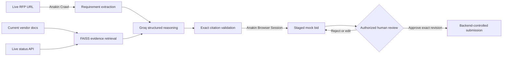

# Anakin RFP Bidder

**An agentic procurement workflow that reads a live RFP, retrieves current vendor evidence, drafts source-grounded responses, stages a bid, and stops at an explicit human authorization gate before submission.**

Built for the [Anakin Forge Hackathon](https://anakin.io/hackathon/anakin-forge).

**Live demo:** https://anakin-rfp-bidder.onrender.com/

**Demo video:** [Watch the Anakin RFP Bidder walkthrough](https://drive.google.com/file/d/15H0iVh43E-BPwz29og5QM0vGsTsVf7-k/view?usp=sharing)

If the deployed service is waking from idle, the first request may take longer. The local recording demonstrates the complete workflow end to end.

The deployed service runs on Render Free with a deterministic low-memory retrieval path. Local development keeps the full FAISS and SentenceTransformers semantic retrieval path.

---

## The problem

Enterprise procurement teams answer RFPs by manually mapping dozens of technical, security, and compliance requirements to internal evidence — a slow, error-prone process where an unsupported claim is a real legal and business risk.

## The pitch

Most AI tools generate a polished answer. This one proves where that answer came from — and refuses to guess when it can't.

## What makes this different

This is more than a generic RAG wrapper: it combines live RFP ingestion, current vendor evidence, exact citation validation, Anakin browser actuation, and a backend-enforced human approval gate without requiring an external vector database or browser-infrastructure service.

---

## Why this is an agent, not a chatbot

The project executes a complete controlled workflow rather than returning a single response:



Plain-text flow:
```
Live RFP → Anakin Crawl → Evidence retrieval → Groq structured reasoning
→ Exact citation validation → Anakin Browser Session → Staged mock bid
→ Human approval → Controlled mock submission
```

| Stage | What happens |
|---|---|
| **Read** | Anakin Crawl reads the operator-selected public RFP and extracts individual requirements. |
| **Reason** | FAISS retrieves focused, relevant evidence; Groq returns strict schema-constrained answers. |
| **Verify** | Every supported answer must contain one or more exact excerpts found in its retrieved evidence. Unverified output fails closed as `CAPABILITY_NOT_FOUND` — it is never guessed or paraphrased into existence. |
| **Act** | Anakin Browser Sessions creates the draft on a strictly loopback, controlled mock procurement portal. |
| **Authorize** | Only the backend HITL approval endpoint can release the final portal action. Nothing submits without it. |

> **Anakin is central to the demonstrated workflow.** RFP ingestion uses Anakin Crawl and bid staging uses Anakin Browser Sessions — not a generic scraper or simulated browser integration. Vendor evidence is separately fetched from cited live sources and displayed with its retrieval timestamp.

---

## Reproducible live demo

The included demo uses deliberately public, attributable sources:

- **Synthetic RFP:** <https://devaganesh-source.github.io/my-static-site/>
- **Vercel compliance documentation:** <https://vercel.com/docs/security/compliance.md>
- **Vercel live status summary:** <https://www.vercel-status.com/api/v2/summary.json>

The review binder displays the RFP URL, evidence URLs, and evidence-fetch timestamp so the current-data path is visible to a reviewer — nothing is bundled or stale.

---

## Safety properties

- Browser actuation is restricted to the configured loopback mock portal. In the deployed image that portal remains private inside the application container.
- The agent stages a draft but **cannot authorize itself**.
- Approval records one exact reviewed answer set; editing it produces a new revision rather than silently mutating history.
- The backend performs one bounded submission attempt and verifies the resulting portal state.
- Unsupported or incorrectly cited claims are isolated for human review, never presented as verified.
- API keys are loaded only from environment variables — never hardcoded, never committed.
- External calls have bounded timeouts and retries; daily quota exhaustion fails immediately and visibly, rather than silently degrading.

---

## Quick start (local)

Prerequisites: Python 3.11+, Node.js 20+, Groq credentials, and Anakin credentials.

```powershell
git clone https://github.com/devaganesh-source/anakin-rfp-bidder.git
cd anakin-rfp-bidder
python -m venv venv
.\venv\Scripts\Activate.ps1
pip install -r requirements.txt
Copy-Item .env.example .env
cd dashboard
npm install
cd ..
```

Fill in `GROQ_API_KEY` and `ANAKIN_API_KEY` in `.env`, then use three terminals:

```powershell
# Terminal 1: controlled mock procurement portal
.\venv\Scripts\python.exe .\mock_portal\main.py

# Terminal 2: orchestration and HITL API
.\venv\Scripts\python.exe .\start_backend.py

# Terminal 3: review dashboard
cd dashboard
npm run dev
```

Open <http://127.0.0.1:3000>, confirm or replace the live RFP URL, and select **Generate new bid**.

---

## Deploy your own public hackathon link

The repository includes a multi-stage `Dockerfile` and `render.yaml` Blueprint. The image builds the Next.js dashboard as static files and serves them from the FastAPI orchestration service, so the dashboard and API share one public origin. The controlled mock procurement portal runs on container loopback and is not exposed as a second public service.

1. Push the repository to GitHub.
2. In Render, choose **New → Blueprint** and select the repository.
3. Keep the service on the **Free** plan. `render.yaml` enables `RFP_LIGHTWEIGHT_RETRIEVAL=true` so the deployed process stays within the 512 MB memory limit while preserving evidence-grounded retrieval.
4. Supply `GROQ_API_KEY` and `ANAKIN_API_KEY` when Render prompts for the two `sync: false` environment variables. Do not commit either value.
5. Create the Blueprint and wait for `/api/health` to pass.
6. Open the assigned `https://<service-name>.onrender.com` URL. That URL is both the dashboard and the hackathon submission link.

The host injects `PORT`; `deploy_server.py` binds the public API to it and starts exactly one private mock-portal worker on port 8000. The embedding model is cached in the image during the build. Do not set `NEXT_PUBLIC_API_BASE_URL` for this bundled deployment — the dashboard uses same-origin `/api` requests.

The Render Free deployment uses deterministic lexical retrieval to stay within the 512 MB memory limit. Compared with semantic retrieval, this may miss some borderline-relevant evidence matches; those cases correctly fail closed as `CAPABILITY_NOT_FOUND` instead of being presented as unsupported claims.

Before sharing the link, verify:

```text
GET https://<service-name>.onrender.com/api/health
{"status":"ok","service":"anakin-rfp-bidder"}
```

Generate only one bid per recorded path unless the Groq quota has replenished. The dashboard prevents concurrent generation, and daily quota exhaustion fails closed without staging or submitting a partial bid.

---

## Judge demo sequence

1. Open the live demo URL and show the public RFP URL.
2. Generate a bid and show the Anakin Crawl, evidence timestamp, and live status.
3. Compare exact evidence excerpts with their source pages.
4. Explain that unverifiable claims fail closed as `CAPABILITY_NOT_FOUND`.
5. Edit a response and demonstrate exact-revision approval.
6. Complete both attestations and approve the controlled mock submission.
7. Show the submission confirmation.

---

## Verification

The default resilience suite is local and does not spend API credentials:

```powershell
.\venv\Scripts\python.exe .\test_resilience.py
cd dashboard
npm exec tsc -- --noEmit --incremental false
npm run build
```

Run a credentialed end-to-end demo only when the mock portal is running:

```powershell
# Audit live read/reason/act behavior and stop before authorization
.\venv\Scripts\python.exe .\verify_live_demo.py

# Only when you deliberately want to authorize one local mock submission
.\venv\Scripts\python.exe .\verify_live_demo.py --approve
```

---

## Project layout

| Path | Responsibility |
|---|---|
| `run_bid.py` | Read/reason/act orchestration and live evidence ingestion |
| `actuation/anakin_client.py` | Anakin Crawl and Browser Session integration |
| `reasoner/groq_reasoner.py` | Structured generation, quota handling, and citation validation |
| `reasoner/vector_store.py` | Local semantic retrieval (full FAISS locally; deterministic lightweight fallback on Render Free) |
| `actuation/hitl_manager.py` | Authoritative approval state machine |
| `mock_portal/main.py` | Controlled JSON-only procurement target |
| `dashboard/` | Next.js review and authorization interface |
| `test_resilience.py` | Deterministic local safety and workflow checks |
| `verify_live_demo.py` | Credentialed live audit; submission requires `--approve` |

---

## Scope and limitations

This is a hackathon-safe procurement demonstration, not a production bidding service.

- Bid and portal state are intentionally in memory, so a service restart invalidates existing review links.
- Authentication is not implemented, and final actions target only the bundled private mock portal.
- The deployed Render Free instance uses a deterministic keyword-based retrieval fallback to fit within 512 MB of memory; local development uses full semantic embedding retrieval. The grounding, entailment, and approval-gate logic are identical in both paths.
- A production system would require durable encrypted storage, authenticated reviewer identities, audit retention, tenant isolation, abuse controls, and customer-specific evidence connectors.

Keep the demo service at one instance and do not expose it as a general public utility.
