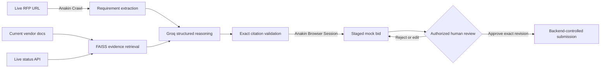

# Anakin RFP Bidder

An agentic procurement workflow that reads a live RFP, retrieves current vendor evidence, drafts source-grounded responses, stages a bid, and stops at an explicit human authorization gate before submission.

Built for the [Anakin Forge Hackathon](https://anakin.io/hackathon/anakin-forge).

## Why this is an agent

The project executes a complete controlled workflow rather than returning a chat response:



- **Read:** Anakin Crawl reads the operator-selected public RFP.
- **Reason:** FAISS retrieves focused evidence and Groq returns schema-constrained answers.
- **Verify:** every supported answer must contain one or more excerpts found in its retrieved evidence. Unverified output fails closed as `CAPABILITY_NOT_FOUND`.
- **Act:** Anakin Browser Sessions creates the draft on a strictly loopback mock procurement portal.
- **Authorize:** only the backend HITL approval endpoint can release the final portal action.

## Reproducible live demo

The included demo uses deliberately public, attributable sources:

- Synthetic RFP: <https://devaganesh-source.github.io/my-static-site/>
- Vercel compliance documentation: <https://vercel.com/docs/security/compliance.md>
- Vercel live status summary: <https://www.vercel-status.com/api/v2/summary.json>

The review binder displays the RFP URL, evidence URLs, and evidence-fetch timestamp so the current-data path is visible to a reviewer.

## Safety properties

- Browser actuation is restricted to the configured loopback mock portal. In the
  deployment image that portal remains private inside the application container.
- The agent stages a draft but cannot authorize itself.
- Approval records one exact reviewed answer set; editing it produces a new revision.
- The backend performs one bounded submission attempt and verifies the resulting portal state.
- Unsupported or incorrectly cited claims are isolated for human review.
- API keys are loaded only from environment variables.
- External calls have bounded timeouts and retries; daily quota exhaustion fails immediately.

## Quick start

Prerequisites: Python 3.11 or newer, Node.js 20 or newer, Groq credentials, and Anakin credentials.

```powershell
git clone https://github.com/devaganesh-source/anakin-rfp-bidder.git
cd anakin-rfp-bidder
python -m venv venv
.\venv\Scripts\Activate.ps1
pip install -r requirements.txt
Copy-Item .env.example .env
cd dashboard
npm install
cd ..
```

Fill in `GROQ_API_KEY` and `ANAKIN_API_KEY` in `.env`, then use three terminals:

```powershell
# Terminal 1: controlled mock procurement portal
.\venv\Scripts\python.exe .\mock_portal\main.py

# Terminal 2: orchestration and HITL API
.\venv\Scripts\python.exe .\start_backend.py

# Terminal 3: review dashboard
cd dashboard
npm run dev
```

Open <http://127.0.0.1:3000>, confirm or replace the live RFP URL, and select **Generate new bid**.

## Deploy one public hackathon link

The repository includes a multi-stage `Dockerfile` and `render.yaml` Blueprint.
The image builds the Next.js dashboard as static files and serves them from the
FastAPI orchestration service, so the dashboard and API share one public origin.
The controlled mock procurement portal runs on container loopback and is not
exposed as a second public service.

1. Push the repository to GitHub.
2. In Render, choose **New → Blueprint** and select the repository.
3. Review the `1c-2g` compute selection before creating the service. It is a
   paid 2 GB plan; the 512 MB free instance does not leave safe runtime headroom
   for PyTorch, FAISS, both FastAPI processes, and the embedding model.
4. Supply `GROQ_API_KEY` and `ANAKIN_API_KEY` when Render prompts for the two
   `sync: false` environment variables. Do not commit either value.
5. Create the Blueprint and wait for `/api/health` to pass.
6. Open the assigned `https://<service-name>.onrender.com` URL. That URL is both
   the dashboard and the hackathon submission link.

The host injects `PORT`; `deploy_server.py` binds the public API to it and starts
exactly one private mock-portal worker on port 8000. The embedding model is cached
in the image during the build, avoiding a Hugging Face download during a live run.
Do not set `NEXT_PUBLIC_API_BASE_URL` for this bundled deployment—the dashboard
uses same-origin `/api` requests. Render's Docker and port requirements are
documented in [Docker on Render](https://render.com/docs/docker) and
[Web Services](https://render.com/docs/web-services). Current compute sizes and
prices are listed on Render's [Compute Plans](https://render.com/docs/compute-plans)
page. Suspend or delete the service after judging if you no longer need it.

Before sharing the link, verify:

```text
GET https://<service-name>.onrender.com/api/health
{"status":"ok","service":"anakin-rfp-bidder"}
```

Generate only one bid for the recorded path unless the Groq quota has replenished.
The dashboard prevents concurrent generation, and daily quota exhaustion fails
closed without staging or submitting a partial bid.

## Judge demo sequence

1. Show the public RFP URL in the dashboard.
2. Generate a bid and show the Anakin Crawl, current evidence timestamp, and live status output.
3. Open two green evidence disclosures and compare the exact excerpts with their source pages.
4. Explain that unverifiable claims are blocked rather than fabricated.
5. Edit a response to demonstrate that the human authorizes an exact revision.
6. Check both attestations and select **Approve & Submit**.
7. Show the `submitting` transition followed by the portal-confirmed success screen.

## Verification

The default resilience suite is local and does not spend API credentials:

```powershell
.\venv\Scripts\python.exe .\test_resilience.py
cd dashboard
npm exec tsc -- --noEmit --incremental false
npm run build
```

Run a credentialed end-to-end demo only when the mock portal is running:

```powershell
# Audit live read/reason/act behavior and stop before authorization
.\venv\Scripts\python.exe .\verify_live_demo.py

# Only when you deliberately want to authorize one local mock submission
.\venv\Scripts\python.exe .\verify_live_demo.py --approve
```

## Project layout

- `run_bid.py` — read/reason/act orchestration and live evidence ingestion
- `actuation/anakin_client.py` — Anakin Crawl and Browser Session integration
- `reasoner/groq_reasoner.py` — structured generation, quota handling, and citation validation
- `reasoner/vector_store.py` — local semantic retrieval
- `actuation/hitl_manager.py` — authoritative approval state machine
- `mock_portal/main.py` — controlled JSON-only procurement target
- `dashboard/` — Next.js review and authorization interface
- `test_resilience.py` — deterministic local safety and workflow checks
- `verify_live_demo.py` — credentialed live audit; submission requires `--approve`

## Scope and limitations

This is a hackathon-safe procurement demonstration, not a production bidding
service. Bid and portal state are intentionally in memory, so a service restart
invalidates existing review links. Authentication is not implemented, and final
actions target only the bundled private mock portal. Keep the demo service at one
instance and do not expose it as a general public utility. A production system
would require durable encrypted storage, authenticated reviewer identities,
audit retention, tenant isolation, abuse controls, and customer-specific evidence
connectors.
